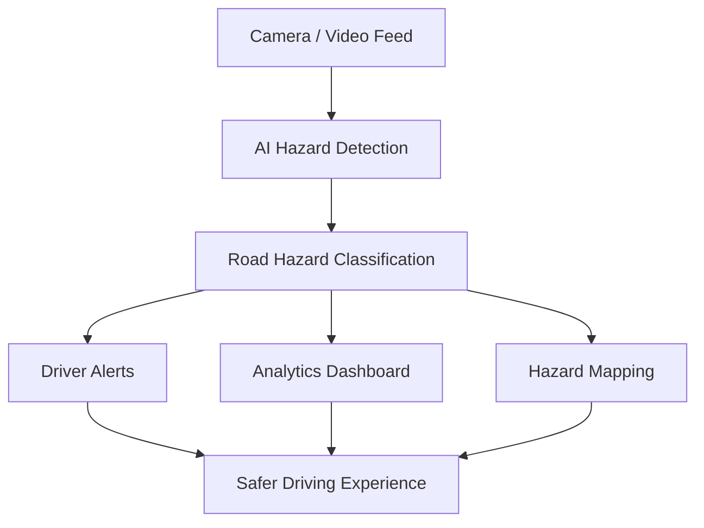

# 🚧 HazarEye

<p align="center">


</p>

<h1 align="center">HazarEye</h1>

<p align="center">
  <strong>AI-Powered Road Hazard Detection & Driver Assistance System</strong>
</p>

<p align="center">
  Improving road safety through intelligent hazard monitoring, smart mapping, and future AI-powered detection.
</p>

<p align="center">
  
  
  
  
</p>

---

# 📖 Overview

HazarEye is a road safety platform designed to assist drivers and authorities by identifying and visualizing road hazards. The project combines interactive mapping, analytics, and a modern driver assistance interface to create a foundation for future AI-powered hazard detection.

The current version focuses on delivering a responsive frontend prototype that demonstrates hazard visualization, smart mapping, and dashboard analytics. Future releases will integrate Computer Vision and Machine Learning models for real-time hazard detection using camera feeds and GPS-enabled navigation.

Built with scalability in mind, HazarEye aims to evolve into a comprehensive intelligent transportation and infrastructure monitoring solution for Indian roads.

---

# 🎯 Vision

To leverage Artificial Intelligence and Computer Vision for detecting road hazards in real time, enabling safer journeys while empowering authorities with data-driven infrastructure monitoring and maintenance.

---

# 🌐 Live Demo

🚀 Demo deployment planned for future releases.

---

# 🌟 Why HazarEye?

* Enhance driver safety through intelligent hazard monitoring
* Improve awareness of road conditions
* Visualize hazards on interactive maps
* Support infrastructure maintenance through analytics
* Designed with Indian road conditions in mind
* Scalable architecture for future AI integration

---

# ✨ Features

| Feature                     | Status            |
| :-------------------------- | :---------------- |
| Responsive User Interface   | ✅ Implemented     |
| Interactive Hazard Map      | ✅ Implemented     |
| Analytics Dashboard         | ✅ Implemented     |
| Driver Assistance Interface | ✅ Implemented     |
| Hazard Visualization        | ✅ Implemented     |
| Real-Time AI Detection      | 🚧 In Development |
| YOLO-Based Hazard Detection | 🚧 Planned        |
| GPS Tracking                | 🚧 Planned        |
| Backend APIs                | 🚧 Planned        |
| Mobile Application          | 🚧 Planned        |

---

# 📸 Screenshots

<p align="center">
 

</p>

---

# 🏗️ System Architecture



---

# 🛠️ Tech Stack

### Frontend

* React.js (v19)
* Vite
* JavaScript (ES6+)
* HTML5 / CSS3
* React Router
* Framer Motion
* React Icons
* Leaflet & React Leaflet
* Recharts

### Backend (Planned)

* Node.js
* Express.js
* Socket.IO
* REST APIs

### AI / ML (Future)

* YOLO Object Detection
* OpenCV
* TensorFlow / PyTorch
* Computer Vision Models

---

# 📂 Project Structure

```text
HazarEye/
│
├── Frontend/
│   ├── src/
│   ├── public/
│   ├── package.json
│   ├── vite.config.js
│   └── index.html
│
├── Backend/            # Planned
│
└── README.md
```

---

# 🚀 Getting Started

## Prerequisites

* Node.js (v18+ recommended)
* npm

Verify your local installation:

```bash
node -v
npm -v
```

## Clone Repository

```bash
git clone https://github.com/Aryan-Chitely/HazarEye.git
cd HazarEye/Frontend
```

## Install Dependencies

```bash
npm install
```

## Start Development Server

```bash
npm run dev
```

Open your browser and navigate to: `http://localhost:5173`

## Production Build

```bash
npm run build
```

## Preview Production Build

```bash
npm run preview
```

---

# ⚡ Quick Start

```bash
git clone https://github.com/Aryan-Chitely/HazarEye.git
cd HazarEye/Frontend
npm install
npm run dev
```

---

# 📜 Available Scripts

| Command           | Description                  |
| ----------------- | ---------------------------- |
| `npm install`     | Install project dependencies |
| `npm run dev`     | Start development server     |
| `npm run build`   | Create production build      |
| `npm run preview` | Preview production build     |
| `npm run lint`    | Run ESLint check             |

---

# 🎯 Current Status

HazarEye is currently in the **prototype** stage.

### Implemented

* Responsive React-based frontend
* Interactive mapping interface
* Analytics dashboard
* Driver assistance UI
* Modern landing page

### Under Development

* Real-time hazard detection
* Camera feed processing
* Backend APIs
* GPS integration
* Database connectivity

---

# 🚀 Roadmap

* [x] Landing Page
* [x] Responsive UI
* [x] Analytics Dashboard
* [x] Smart Mapping Interface
* [ ] YOLO Real-Time Hazard Detection
* [ ] Live Camera Feed Processing
* [ ] GPS Integration
* [ ] Backend APIs
* [ ] Database Integration
* [ ] Mobile Application
* [ ] Community Hazard Reporting
* [ ] Government Dashboard
* [ ] Cloud Deployment

---

# 🔮 Future Vision

HazarEye aims to become a complete intelligent road safety ecosystem by integrating:

* Real-time AI camera inference
* Cloud-based hazard reporting
* Android and iOS applications
* GPS-assisted navigation
* Smart city infrastructure integration
* Emergency response notifications
* Government monitoring dashboards

---

# 💡 Use Cases

* Driver Assistance Systems (ADAS)
* Smart City Infrastructure
* Road Condition Monitoring
* Traffic Management
* Fleet Management
* Municipal Road Maintenance
* Navigation Applications

---

# 🤝 Contributing

Contributions are welcome.

1. Fork the repository
2. Create a feature branch (`git checkout -b feature/new-feature`)
3. Commit your changes (`git commit -m "Add new feature"`)
4. Push to the branch (`git push origin feature/new-feature`)
5. Open a Pull Request

---
